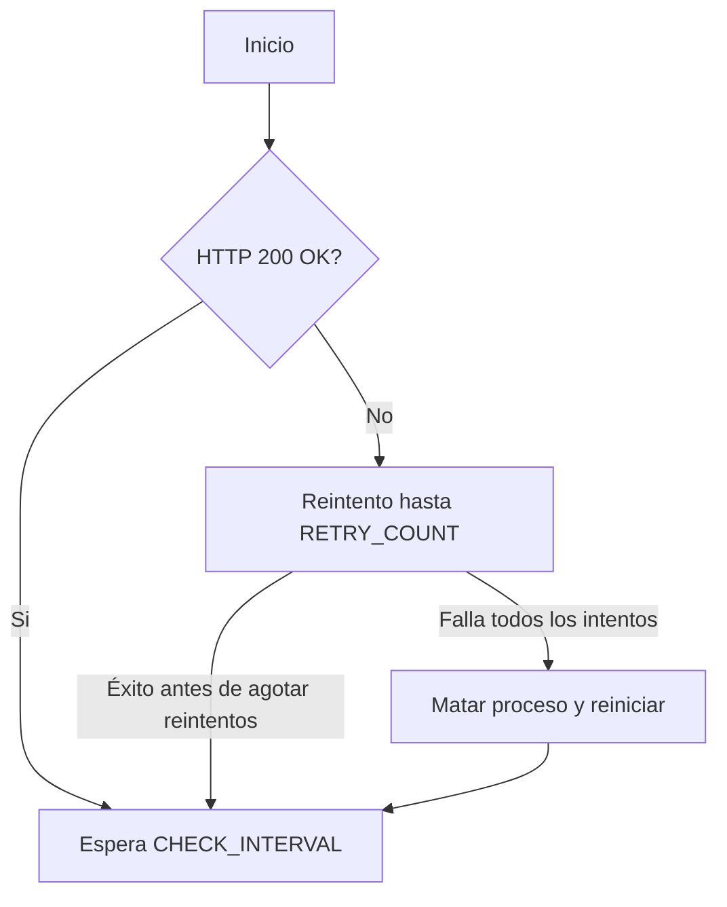

# SailPoint Endpoint Monitor and Auto-Restarter

## 📊 Objetivo
Este script en **bash** monitoriza de forma continua un endpoint de una instancia de SailPoint (o cualquier otro servicio web) y, en caso de detectar caída tras varios intentos, **reinicia automáticamente el servicio**.

## ⚙️ Configuración Inicial

Antes de ejecutar el script, asegúrate de ajustar las siguientes variables:

| Variable | Descripción |
|:---|:---|
| `URL` | URL del endpoint a monitorizar (por ejemplo, `http://<YOUR-URL>/login`) |
| `CHECK_INTERVAL` | Intervalo entre chequeos, en segundos (por defecto 60) |
| `RETRY_COUNT` | Número de reintentos permitidos antes de reiniciar (por defecto 3) |
| `TIMEOUT` | Timeout de `curl`, en segundos (por defecto 10) |
| `START_COMMAND` | Comando para levantar el servicio de SailPoint |
| `PROCESS_NAME` | Nombre del proceso que será terminado en caso de caída |

## 🔄 Funcionamiento

1. El script realiza una llamada HTTP al `URL` usando `curl`.
2. Si el código de estado HTTP **no es 200**, se cuenta como fallo.
3. Si tras `RETRY_COUNT` intentos el servicio sigue caído:
   - Mata el proceso correspondiente.
   - Ejecuta el comando para reiniciar el servicio.
   - Espera a que el servicio arranque antes de continuar.
4. El ciclo se repite indefinidamente.

## ⚠️ Consideraciones

- Asegúrate de que el `PROCESS_NAME` es específico para evitar matar procesos incorrectos.
- El `START_COMMAND` debe estar probado manualmente.
- Se recomienda ejecutarlo como servicio del sistema (`systemd`) o usar `nohup` para mantenerlo activo.

## 🔄 Flujo Resumido



## 📂 Ejemplo de Configuración
```bash
URL="http://sailpoint-ui.com/login"
CHECK_INTERVAL=60
RETRY_COUNT=3
TIMEOUT=10
START_COMMAND="/opt/spadmin/iam/bin/start.ksh"
PROCESS_NAME="user"
```

## 🚀 Ejecución

```bash
chmod +x monitor_sailpoint.sh
./monitor_sailpoint.sh
```

Para dejarlo corriendo en segundo plano:

```bash
nohup ./monitor_sailpoint.sh &
```

---

_Desarrollado para garantizar la alta disponibilidad de SailPoint IdentityIQ 🔧_
